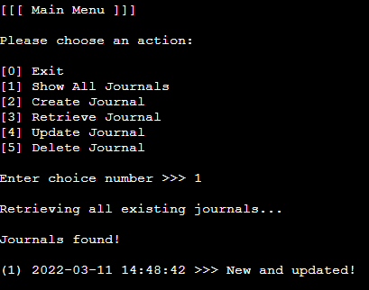

# Command Line Journal

## Disclaimer
The stories, people, brands and products in this software development project are fictitious and any resemblance to real life occurrence is by pure coincidence. The developer of this project, as part of an academic portfolio, referred to and used various open source materials available online to create an interactive brochure website, all of which are credited at the end.

## Project Overview
Grey Operations is a sole propiertorship which offers productivity software solutions.

This backened development project is an MVP for a greater scope related to the development of automated processing of data stored in spreadsheets.

The current objective is to create a command line interface application for journal entry management.

## Stakeholder Expectations

### Business, Research and Development Case
Assess viability of various technologies such as Heroku and Google Sheets API.

### Target Audience
This is an internal project for research and development. 
Current scope of features are suitable for software hobbyists that wish to use the terminal for logging text data for later processing via Google Sheets.

### User Experience

Product use-case outlined in terms of user needs.

As a user of this web application I want to be able to:

1. Create, retrieve, update and delete journal entries via terminal.
2. Store data in Google Drive for further processing.
3. Save data even after exiting application.

## Project Management

Managed using Prince2 methodology in para-sequential stages where features are developed in phases during which the project can terminte while delivering a usable and meaningful set of product features. Stage X commences when all stages are completed or terminated early.

MVP reached, project is currently dormant.

Project terminated early due to time contraints. 

Stage 1
* ~~User Input System~~ - COMPLETE
* ~~Data Manipulation System~~ - COMPLETE
* ~~Save System~~ - COMPLETE

Stage 2
* ~~User Input Feedback~~ - COMPLETE
* Backup System
* New User Input: Custom ID/Timestamp with Error Handling

Stage 3
* New Front End Design
* More Data Types For Journal Entries

Stage X
* ~~Final testing and bug fixing~~ COMPLETE

## Design

### Code Logic Diagram

[Drawio](https://www.diagrams.net/) was chosen for the wireframing environment as it offers desired functions for free and runs within the chosen coding environment (Gitpod) using an [unofficial plugin](https://marketplace.visualstudio.com/items?itemName=hediet.vscode-drawio) for simplified access.

  
  
  

### Front End

A template is used to display a terminal window for user input.
Currently this is the visual design choice to focus efforts on back-end development.

## Development Log

### Changes

1. Journal Entry uses timestamp to store time related data on database.
2. More main menu items: show all journals, exit application.

### Features

#### Implemented

* Data Manipulation System 
  * Backened logic CRUD operations on data.
* Save System
  * Data is stored on Google Sheets via API.
* User Input System and User Input Feedback
  * Command line user interface for simplified user input (integer based) for activation of CRUD operations with printed feedback.

_See Testing Section for Revelant Screenshots_

#### Backlog

### Bugs

#### Fixed  
* Import Error caused by `pynput` module for Python - fixed by using `keyboard` module according to this [forum discussion](https://unix.stackexchange.com/questions/427345/keyboard-monitoring-without-display). Screenshot [here](./dev/media/pynput_error.png).
* Import Error caused by `keyboard` module for Python, requires root - to be fixed by ~~using `Python-evdev` module as an alternative.~~ this may not be possible because of keyboard device requirements. Issue will be fixed using input() instead. Screenshot [here](./dev/media/keyboard_error.png).

#### Backlog

### Testing

#### Validator Testing

No errors according to this [PEP8 validator tool](http://pep8online.com/).

Screenshots:

* [choice_api](./dev/media/choice_check.png)
* [data_api](./dev/media/data_check.png)
* [display_api](./dev/media/display_check.png)
* [helper_api](./dev/media/helper_check.png)
* [run](./dev/media/run_check.png)

#### Manual + User Experience Testing

1. Create, retrieve, update and delete journal entries via terminal.  


  

  

  


* Application displays a main menu with the following actions: exit, show all journals, create journal, retrieve journal, update journal, and delete journal.
  * These actions are numbered in integers.
  * The application requests an integer from the user to select the desired action.
  * The main menu reappears after completing taking actions or cancelling a task, see next section.
* User actions
  * Exiting the application is selected with the number 0 to avoid accidental termination of the app.
  * A message is displayed when the application terminates.
  * Show all journals displays all available journals or the sub-menu if empty or an error occurs.
  * Create journal requests text from the user or displays the sub-menu if an error occurs.
  * Journal entry data are automatically created e.g. timestamp or integer identity.
  * Retrieve journal requests an integer as the journal identity from the user and displays the target journal or sub-menu if an error occurs.
  * Update journal requests an integer as the journal identity from the user and displays the target journal or sub-menu if an error occurs.
  * Delete journal requests an integer as the journal identity from the user and displays success message or sub-emnu if an error occurs.


  


* Additionally, when errors occur, a sub-menu is displayed with the following actions: cancel, and try again.
  * These actions are numbered in integers.
  * The application requests an integer from the user to select the desired action.
  * Cancel displays the main menu.
  * Try again reattempts the action.

2. Store data in Google Drive for further processing.


* Application is connected to a database via a Google API service account.
* This allows the user to manipulate data stored in Google Sheets.
  
3. Save data even after exiting application.

* Thanks to the Google Sheets database system, previously stored data can be accessed again even after terminating the app, see screenshots in Item 2.
* Main menu actions allow users to retrieve existing data, see screenshots in Item 1.

## Deployment

With the help of this [tutorial](https://devcenter.heroku.com/articles/getting-started-with-python?singlepage=true) and this [tutorial](https://devdojo.com/bryanborge/adding-google-cloud-credentials-to-heroku), the website was deployed to Heroku using the following steps:
1. Enter and run `pip3 freeze > requirements.txt` to record app dependencies.
2. After signing up / logging in to Heroku, select the `New` button.
3. Select `Create New App` in the drop-down menu that appears.
4. Enter a unique name for your application.
5. Select a region.
6. Select the `Create App` button.
7. In the menu that appears at the top of the page, select the `Settings` button.
8. Go to the `Config Vars` section and select the `Reveal Config Vars` button.
9. For `Key` enter the word _port_, for `Value` enter the number _8000_, and then select the `Add` button.
10. Repeat Step 9, however, for `Key` enter _CREDS_, for `Value` enter credentials data e.g. _{...}_
11. Go to the `Buildpack` section and select the `Add Buildpack` button.
12. Select `python` in the drop-down menu that appears and then select the `Save` button.
13. Select the `Add Buildpack` button again and select `node.js` in the drop-down menu that appears and then select the `Save` button.

Note the buildpack must be in this order: _Python_ then _Node.js_

14. In the menu that appears at the top of the page, select the `Deploy` button.
15. Go to the `Deployment method` section and select the `Github` button to deploy via Github.
16. Sign in to Github if required and authorize Heroku to connect to Github.
17. Go to the `Connect to Github` section, enter the repository name, and select the `Search` button.
18. Select the `Connect` button that appears beside the desired repository.
19. Go to the `Automatic deploys` section, select the appropriate branch, and select the `Enable Automatic Deploys` button.
20. For manual deployment, go to the `Manual deploy` section, select the appropriate branch, and select the `Deploy Branch` button.
21. Carry out Step 20 to deploy the app immediately or Step 19 to deploy the app when changes are 'pushed'.

The live page is available [here](https://command-line-journal.herokuapp.com/).

## Forking Github Repos

According to [official Github documentation](https://docs.github.com/en/get-started/quickstart/fork-a-repo), this repo can be forked using the following steps:
1. After logging in, navigate to the target Github repo.
2. Select the "Fork" button located in top-right area of the page.
3. Select target location for the forked repo.

## Cloning Forked Repo via HTTPS

Additionally, you can download a local copy of the forked repo using the following steps:
1. After logging in to Github, navigate to the desired forked repo.
2. Select the "Code" button.
3. Copy the URL link below "Clone with HTTPS".
4. In a terminal with "GIT" installed, navigate to your target directory.
5. Using the `git clone` command, paste in the URL and press enter:
```
$ git clone https://github.com/YOUR-USERNAME/YOUR-REPO 
\> Cloning into `YOUR-REPO`...
\> remote: Counting objects: 10, done.
\> remote: Compressing objects: 100% (8/8), done.
\> remove: Total 10 (delta 1), reused 10 (delta 1)
\> Unpacking objects: 100% (10/10), done.
```

## Credits

Maintaining competence requires continuous learning from and reflection upon the work of others. It is important to give credit and acknowledgement not only to recognise time and effort expended but also to illustrate the rationale behind the methods applied and direct observers to the origins thereof.

This project used the following resources for inspiration and instruction:

Tutorials

* [Getters and Setters in Python](https://www.geeksforgeeks.org/getter-and-setter-in-python/)
* [Nametuples in Python](https://www.freecodecamp.org/news/python-namedtuple-examples-how-to-create-and-work-with-namedtuples/)
* [Detect Key Press in Python](https://www.geeksforgeeks.org/how-to-detect-if-a-specific-key-pressed-using-python/)
* [Deployment to Heroku](https://devcenter.heroku.com/articles/getting-started-with-python?singlepage=true)
* [Adding creds.json to Heroku](https://devdojo.com/bryanborge/adding-google-cloud-credentials-to-heroku)

Development Tools / Sources

_See technologies section for development environment and content generators / sources._

### Technologies

Development Environment
* [GitPod](https://www.gitpod.io/)
* [Drawio](https://www.diagrams.net/) + [Unofficial VSCode Plugin](https://marketplace.visualstudio.com/items?itemName=hediet.vscode-drawio)
* [Github](https://github.com/)
* [Heroku](https://heroku.com/)

Testing
* [PEP8 Checker](http://pep8online.com/)

Content Generators / Sources
* [Code Institute Python Environment Template](https://github.com/Code-Institute-Org/python-essentials-template)
* [Code Formatter](https://extendsclass.com/python-formatter.html)

Frameworks / Libraries
* [Gpsread for Python](https://gspread.org/)
* [Google Auth for Python](https://google-auth.readthedocs.io/en/master/)
* [Python-evdev for Python](https://python-evdev.readthedocs.io/en/latest/)

Languages
* [HTML5 - Included in Template](https://www.w3schools.com/html/)
* [CSS - Included in Template](https://www.w3schools.com/css/)
* [Javascript - Included in Template](https://www.w3schools.com/js/)
* [Python](https://www.w3schools.com/python/)

### Further Acknowledgements
The vibrant [Slack](https://slack.com/) community, cohort, tutors and my mentor Akshat Garg at [Code Institute](https://codeinstitute.net/).

[Code Institute](https://codeinstitute.net/), [FreeCodeCamp](https://www.freecodecamp.org/), [TheOdinProject](https://www.theodinproject.com/), and [W3Schools](https://www.w3schools.com/) for providing me with fundamental skills for software development.

[Prince2](https://www.axelos.com/certifications/propath/prince2-project-management) for the project management methodology.